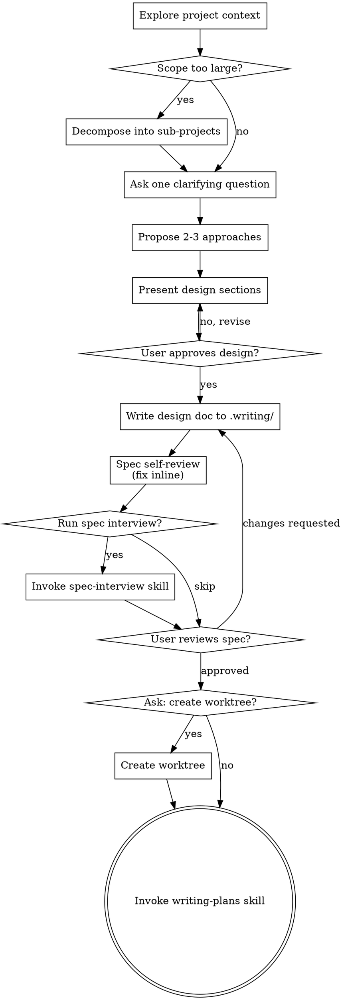

# Brainstorming Ideas Into Designs

Help turn ideas into fully formed designs and specs through natural collaborative dialogue.

**Announce at start:** "I'm using the brainstorming skill to explore this design."

Start by understanding the current project context, then ask questions to refine the idea. Once you understand what you're building, present the design and get user approval.

<EXTREMELY-IMPORTANT>
Do NOT invoke any implementation skill, draft any section, scaffold any manuscript, or take any execution action until you have presented a design and the user has approved it. This applies to EVERY project regardless of perceived simplicity.
</EXTREMELY-IMPORTANT>

## Anti-Pattern: "This Is Too Simple To Need A Design"

Every project goes through this process. A todo list, a single-function utility, a config change — all of them. "Simple" projects are where unexamined assumptions cause the most wasted work. The design can be short (a few sentences for truly simple projects), but you MUST present it and get approval.

## Checklist

You MUST create a task for each of these items and complete them in order:

1. **Explore project context (Iterative Retrieval)** — don't just scan files once. Use a structured loop to progressively discover relevant context:

   **Cycle 1 — Broad Sweep:**
   - Scan project structure (Glob for key directories and file patterns)
   - Search for keywords related to the user's request (Grep)
   - Read project docs, README, CLAUDE.md, recent commits
   - Check `.writing/archive/*.md` for relevant historical archives — if found, read related archives and note relevant Key Decisions and Lessons Learned under a `## Historical Context` section
   - Save initial findings to `.writing/findings.md`

   **Evaluate & Identify Gaps:**
   - Score each discovered file/component: **High** (directly implements target functionality), **Medium** (contains related patterns or types), **Low** (tangentially related — exclude from further exploration)
   - Identify missing context: "What do I still not understand about how this will integrate?"
   - Note terminology the codebase actually uses (it may differ from the user's request wording)

   **Cycle 2–3 — Targeted Refinement (only if gaps remain):**
   - Search using codebase-native terminology discovered in previous cycles
   - Follow imports, type definitions, and call chains from high-relevance files
   - Read complete implementations of the most relevant files (not just grep snippets)
   - Update `.writing/findings.md` with new discoveries after each cycle (2-Action Rule)

   **Stop when:** 3+ high-relevance files identified AND no critical context gaps remain, OR 3 cycles completed. Don't over-explore — 3 deeply understood files beats 10 skimmed ones.
2. **Scope check** — before refining details, determine whether the request actually describes multiple independent subsystems. If yes, propose decomposition first.
3. **Ask clarifying questions** — ask one question at a time via `AskUserQuestion` to understand purpose, constraints, success criteria. Record key user answers and decisions to `.writing/findings.md`.
4. **Propose 2-3 approaches** — with trade-offs and your recommendation, presented via `AskUserQuestion` for user to choose.
5. **Present design** — in sections scaled to complexity, get user approval after each section via `AskUserQuestion`.
6. **Write design doc** — save to `.writing/design.md` (initialize `.writing/` first if needed).
7. **Spec self-review** — quick inline check for placeholders, contradictions, ambiguity, scope (see below).
8. **Spec interview** — ask: "Do you want to run a spec interview to refine details in the design?" (default: yes). If yes, invoke `superpower-writing:spec-interview` with the design doc as target. If user skips, proceed.
9. **User review gate** — explicitly ask the user to review the written spec before planning.
10. **Ask about worktree** — use `AskUserQuestion` to ask whether to create an isolated git worktree for implementation (invoke `superpower-writing:git-worktrees` if yes, skip if no).
11. **Transition to implementation** — invoke writing-plans skill to create implementation plan.

## Process Flow

**The terminal state is invoking writing-plans.** The allowed intermediate skills before writing-plans are: `spec-interview` (to refine the design) and `git-worktrees` (to isolate work). Do NOT invoke any implementation skill.

## The Process

**Understanding the idea:**
- Check out the current project state first (files, docs, recent commits)
- Before asking detailed questions, check whether the project is too large for a single spec
- If the request covers multiple independent subsystems, decompose it first and brainstorm only the first sub-project through the normal flow
- Ask **one question at a time** per `AskUserQuestion` call
- Prefer multiple choice options when possible, but open-ended is fine too
- Focus on purpose, constraints, success criteria

**Exploring approaches:**
- Propose 2-3 different approaches with trade-offs via `AskUserQuestion`
- Lead with your recommended option and explain why
- Include trade-off descriptions in each option

**Presenting the design:**
- Once you understand what you're building, present the design
- Scale each section to its complexity: a few sentences if straightforward, up to 200-300 words if nuanced
- Use `AskUserQuestion` after each section to confirm it looks right
- Cover architecture, components, data flow, error handling, testing
- Design for **clear boundaries and isolated responsibilities**
- Prefer smaller, focused files over large do-everything files
- If a file has grown unwieldy, include a split in the design when it directly serves the current task
- **Evidence-first design:** Every design decision (architecture choice, performance assumption, complexity trade-off, interface contract) should be backed by evidence — benchmarks, data, reference implementations, or reasoned analysis. When evidence is not yet available, mark the decision with `[NEEDS-EVIDENCE]` inline and continue. Do NOT block design progress to gather evidence, but do NOT silently assume either.

## After the Design

**Documentation:**
- Write the validated design to `.writing/design.md`
- Use elements-of-style:writing-clearly-and-concisely skill if available

**Initialize `.writing/` directory:**
- Run `${CLAUDE_PLUGIN_ROOT}/scripts/init-writing-dir.sh` to create the directory with canonical templates
- Populate the Task Status Dashboard in `progress.md` with tasks derived from the design
- Move any design exploration findings (rejected approaches, discovered constraints, useful references) into `.writing/findings.md`

**Spec Self-Review:**
After writing the spec document, review it yourself with fresh eyes:

1. **Placeholder scan:** Any "TBD", "TODO", incomplete sections, or vague requirements? Fix them.
2. **Internal consistency:** Do any sections contradict each other? Does the architecture match the feature descriptions?
3. **Scope check:** Is this focused enough for a single implementation plan, or does it need decomposition?
4. **Ambiguity check:** Could any requirement be interpreted two different ways? If so, pick one and make it explicit.

Fix any issues inline. No need to re-review — just fix and move on.

**User Review Gate:**
After the self-review, ask the user to review the written spec before proceeding.

**Implementation:**
- Invoke the writing-plans skill to create a detailed implementation plan
- writing-plans is the terminal step. (`spec-interview` and `git-worktrees` are allowed intermediate steps before it.)

## Key Principles

- **Always use AskUserQuestion** — all user-facing questions MUST use this tool
- **One question per call** — don't overwhelm; break complex topics into multiple calls
- **Multiple choice preferred** — easier to answer than open-ended when possible
- **YAGNI ruthlessly** — remove unnecessary features from all designs
- **Evidence-first** — every design decision needs evidence (data, benchmarks, analysis, references). No evidence yet? Mark `[NEEDS-EVIDENCE]` and move on — don't block, don't silently assume
- **Iterative retrieval** — start broad, evaluate relevance, refine search terms using codebase-native terminology, repeat (max 3 cycles). Stop at "good enough" — depth over breadth
- **Explore alternatives** — always propose 2-3 approaches before settling
- **Incremental validation** — present design, get approval before moving on
- **Be flexible** — go back and clarify when something doesn't make sense
- **Large systems must decompose** — do not let one spec sprawl across multiple independent subsystems
- **Small, focused files** — file boundaries and responsibilities should be explicit before planning
