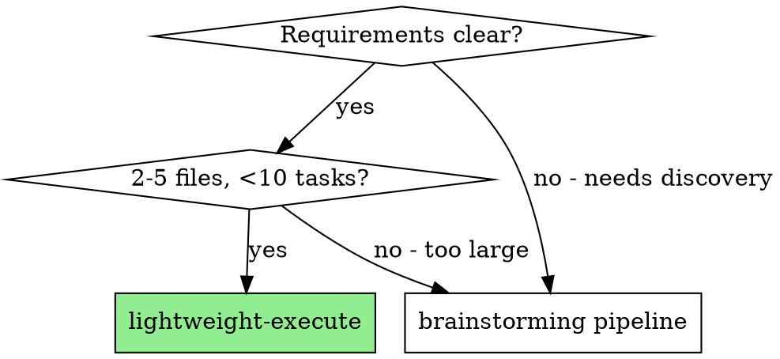
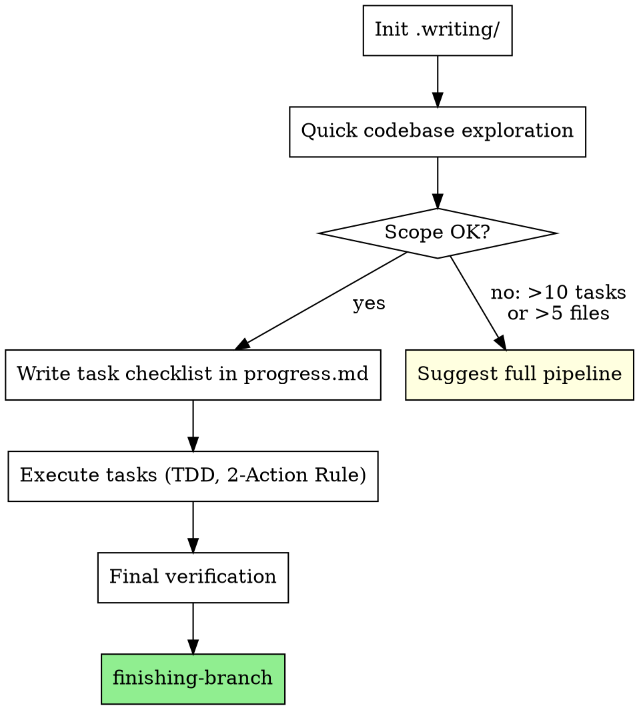

# Lightweight Execution

Fast structured execution with `.writing/` tracking but without brainstorming, formal plans, or review loops.

**Core principle:** Clear requirements + direct implementation + `.writing/` tracking + verification = fast delivery without ceremony.

**Announce at start:** "I'm using the lightweight-execute skill for fast structured execution."

## When to Use



**vs. Full Pipeline:**

| Aspect | Lightweight | Full Pipeline |
|--------|------------|---------------|
| Planning | Task checklist in `progress.md` | Design doc + formal plan in `.writing/` |
| Review loops | None (self-review only) | Two-stage per-task (spec + quality) |
| Execution | Direct in current session | Subagent-driven, team-driven, or batch |
| Subagents | None | One new subagent invocation per task or agent team |
| `.writing/` | Yes | Yes |
| TDD | Yes | Yes |
| Verification | Yes | Yes |

## The Process



### Step 1: Initialize `.writing/`

1. Check if `.writing/` directory exists in the project root
2. If NOT found: run `${CLAUDE_PLUGIN_ROOT}/scripts/init-writing-dir.sh`
3. If FOUND: read `progress.md` and `findings.md` to recover any existing context

### Step 2: Quick Codebase Exploration

- Identify files relevant to the task (Glob, Grep, Read)
- Understand existing patterns and conventions
- Record findings to `.writing/findings.md`
- Follow the 2-Action Dispatch Rule: after every 2 read/search operations, save findings immediately

### Step 3: Scope Guard

**If exploration reveals the task is larger than expected (>10 tasks or >5 files):**

STOP. Tell the user:
```
This task is larger than lightweight execution can handle well:
- [N] tasks identified (limit: 10)
- [N] files involved (limit: 5)

Recommend switching to the full pipeline:
- /brainstorm for structured design exploration
- /write-plan for formal implementation planning
```

Only proceed if the task fits within scope.

### Step 4: Write Task Checklist

Write the task checklist directly into `.writing/progress.md` Task Status Dashboard:

```markdown
| Task | Status | Spec Review | Quality Review | Agent/Batch | Key Outcome |
|------|--------|-------------|----------------|-------------|-------------|
| Task 1: [name] | ⏳ pending | - | - | direct | - |
| Task 2: [name] | ⏳ pending | - | - | direct | - |
| Task 3: [name] | ⏳ pending | - | - | direct | - |
```

Review columns are marked `-` (lightweight mode has no review loops — per template comment: "For executing-plans or other modes, these columns may be left as '-'").

Also create TaskCreate entries for session-scoped tracking.

Each task should specify:
- Files to create or modify
- What to implement
- How to verify (test command or expected behavior)

### Step 5: Execute Tasks

Implement tasks one at a time in the current session. For each task:

1. Mark as `in_progress` in Dashboard and via TaskUpdate
2. Follow test-first discipline: write a failing test, watch it fail, write the minimal implementation, watch it pass, then refactor.
3. Follow the 2-Action Dispatch Rule — save findings every 2 operations
4. Commit after each meaningful unit of work
5. Mark as `✅ complete` in Dashboard and via TaskUpdate
6. If stuck: follow the Error Escalation Protocol (from planning-foundation) — escalate to user after first failed fix, do NOT independently try alternative approaches

### Step 6: Final Verification

**REQUIRED SUB-SKILL:** `superpower-writing:verification`

- Run the full test suite
- Verify all tasks in Dashboard show `✅ complete`
- Record verification evidence in the Verification Evidence table in `progress.md`
- No completion claims without fresh evidence

### Step 7: Finish Branch

**REQUIRED SUB-SKILL:** `superpower-writing:finishing-branch`

This handles test verification, merge/PR options, and worktree cleanup.

## What This Skill Skips

- No brainstorming ceremony (Q&A, approach proposals, design doc)
- No spec interview
- No formal plan document (`.writing/plan.md`)
- No plan review loop
- No subagent dispatching (you implement directly)
- No per-task two-stage review (spec + quality)
- No execution strategy choice (always direct)

## What This Skill Keeps

- `.writing/` directory with `progress.md` and `findings.md`
- Task Status Dashboard tracking
- 2-Action Dispatch Rule (save findings every 2 operations)
- TDD discipline (test first, watch fail, implement, watch pass)
- Verification before completion claims
- finishing-branch at the end

## Red Flags

**Never:**
- Use for tasks requiring architectural decisions or design exploration (use brainstorming)
- Use when scope is unclear or requirements need discovery
- Skip TDD for implementation
- Skip final verification
- Claim completion without evidence
- Continue if task grows beyond 10 tasks or 5 files (suggest full pipeline instead)

## Integration

**Inherits:** `superpower-writing:planning-foundation`
**Uses for verification:** `superpower-writing:verification`
**Required at end:** `superpower-writing:finishing-branch`
**Alternative:** `superpower-writing:brainstorming` → full pipeline for complex work
