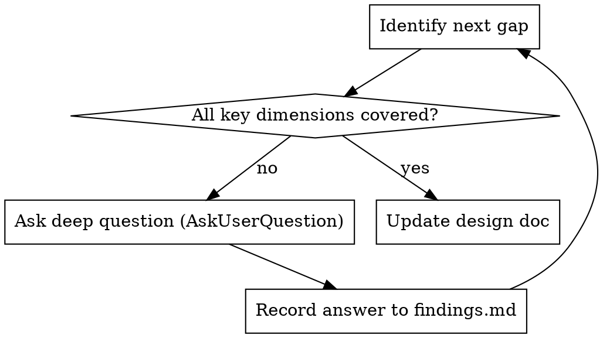

# Spec Interview

Refine draft specs and design docs into complete technical documents through deep, probing questions.

## When This Runs

- **Automatically** after brainstorming produces a design doc (user can skip)
- **Manually** when user says "help me refine this plan/spec" or "ask me about the project"
- When a draft spec or plan.md is missing critical details

## The Process

```
Read target doc → Identify gaps → Ask deep questions (AskUserQuestion) → Iterate → Update doc
```

### Step 1: Read and Analyze

Read the design doc (from brainstorming) or user-specified document. Identify information gaps across these dimensions:

| Dimension | Focus Areas |
|-----------|-------------|
| Technical implementation | Data structures, algorithm choices, dependencies, interface design |
| Edge cases | Null values, concurrency, timeouts, extreme data volumes |
| Risk considerations | Security, performance bottlenecks, compatibility, maintenance cost |
| Trade-offs | Implementation complexity vs flexibility, performance vs readability |
| Architecture decisions | Module boundaries, dependency direction, extension points |
| Acceptance & testing | Acceptance criteria, test strategy, coverage expectations |
| Operability | Observability, logging, migration/rollback strategy |

### Step 2: Deep Questioning

Use the `AskUserQuestion` tool for ALL questions. Never ask questions in plain text.

**Questioning principles:**
- Ask deep questions, not obvious ones
- 1-2 related questions per round (use AskUserQuestion's multi-question support)
- Follow up on vague answers until you get concrete details
- Proactively raise scenarios the user may not have considered

**Question types:**
```
Tech choice:    Why X over Y? Have you evaluated Z?
Edge handling:  When [extreme case] happens, what's the expected behavior?
Trade-off:      If you must choose between [A] and [B], which takes priority?
Dependency:     How tightly does this depend on [component X]?
Fallback:       If [assumption] doesn't hold, what's the backup plan?
```

### Step 3: Iterate Until Complete



### Step 4: Update Document

After the interview is complete, integrate all clarifications back into the original document:
- Preserve existing structure, fill in missing details
- Annotate key decisions with their rationale
- List identified risks and mitigations
- Commit the updated document
- Also persist key findings (rejected alternatives, risk assessments, non-obvious decisions) to `.writing/findings.md`

## Return to Calling Flow

If invoked from brainstorming, return control to the brainstorming checklist. The next step is typically **Ask about worktree**, then **Transition to implementation**. Do NOT invoke writing-plans directly from here — let the brainstorming flow handle the transition.

If invoked standalone (user manually triggered), simply end after committing the updated document.

## Common Mistakes

| Mistake | Correct Approach |
|---------|-----------------|
| Asking obvious questions | Ask about scenarios the user hasn't considered |
| Too many questions at once | 1-2 related questions per AskUserQuestion call |
| Accepting vague answers | Follow up until you get concrete details |
| Only focusing on features | Cover all seven dimensions |
| Not updating the doc after | Immediately write findings into the document |
| Asking in plain text | ALWAYS use AskUserQuestion tool |
