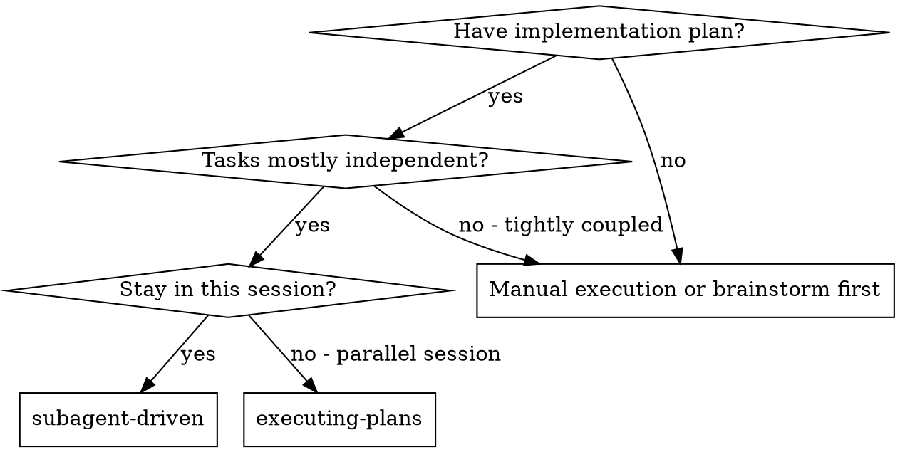
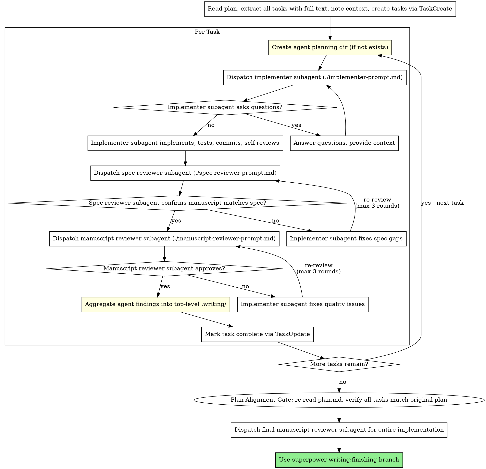

# Subagent-Driven Development

Execute plan by dispatching one new subagent invocation per task, with two-stage review after each: spec compliance review first, then manuscript review. Each subagent gets its own planning directory for structured knowledge capture.

**Core principle:** One new subagent invocation per task + per-agent planning dir + two-stage review (spec then quality) = high quality, fast iteration

**Announce at start:** "I'm using the subagent-driven skill to execute this plan."

## Shared Review Protocol

The two-stage review gate (spec then quality), the 3-round cap with escalation, the plan-anchoring rules for verbatim task extraction, the plan-alignment gate for cumulative drift, and the per-agent planning-directory convention are the same across subagent-driven and team-driven. They live in [`../planning-foundation/references/review-loop-protocol.md`](../planning-foundation/references/review-loop-protocol.md) — read it before executing any task. This skill applies that protocol using one-shot subagent dispatches: a fresh subagent per task, a dedicated spec-reviewer subagent, then a manuscript-reviewer subagent, escalating to the user directly if any loop hits the 3-round cap.

## When to Use

**vs. Executing Plans (parallel session):**
- Same session (no context switch)
- One new subagent invocation per task (no context pollution)
- Per-agent planning directories (structured knowledge capture)
- Two-stage review after each task: spec compliance first, then manuscript quality
- Faster iteration (no human-in-loop between tasks)

## The Process

## Prompt Templates

- `./implementer-prompt.md` - Dispatch implementer subagent (includes planning dir injection)
- `./spec-reviewer-prompt.md` - Dispatch spec compliance reviewer subagent
- `./manuscript-reviewer-prompt.md` - Dispatch manuscript reviewer subagent

## Example Workflow

A complete worked example — one implementer question, one spec-review fail-and-fix, one manuscript-review fail-and-fix, across two tasks — lives in [`references/example-session.md`](references/example-session.md). Read it when you want to see how the process digraph above maps to actual messages.

## Advantages

**vs. Manual execution:**
- Subagents follow TDD naturally
- Fresh context per task (no confusion)
- Parallel-safe (subagents don't interfere)
- Subagent can ask questions (before AND during work)
- Per-agent planning dirs capture knowledge persistently

**vs. Executing Plans:**
- Same session (no handoff)
- Continuous progress (no waiting)
- Review checkpoints automatic

**Efficiency gains:**
- No file reading overhead (controller provides full text)
- Controller curates exactly what context is needed
- Subagent gets complete information upfront
- Questions surfaced before work begins (not after)
- Planning dirs prevent knowledge loss between subagents

**Quality gates:**
- Self-review catches issues before handoff
- Two-stage review: spec compliance, then manuscript quality
- Review loops ensure fixes actually work
- Spec compliance prevents over/under-building
- Manuscript quality ensures implementation is well-built
- Aggregation preserves findings for future tasks

**Cost:**
- More subagent invocations (implementer + 2 reviewers per task)
- Controller does more prep work (extracting all tasks upfront)
- Review loops add iterations
- But catches issues early (cheaper than debugging later)

## Red Flags

**Never:**
- **Skip reviews** — see Two-Stage Review Gate above. No exceptions.
- Start implementation on main/master branch without explicit user consent
- Dispatch multiple implementation subagents in parallel (conflicts)
- Make subagent read plan file (provide full text instead)
- Skip scene-setting context (subagent needs to understand where task fits)
- Ignore subagent questions (answer before letting them proceed)
- Accept "close enough" on spec compliance (reviewer found issues = not done)
- Start manuscript review before spec compliance passes (wrong order)
- Skip planning dir creation or aggregation step (knowledge gets lost)

**If subagent asks questions:**
- Answer clearly and completely
- Provide additional context if needed
- Don't rush them into implementation

**If reviewer finds issues:**
- Implementer (same subagent) fixes them
- Reviewer reviews again
- Maximum 3 fix-review rounds per review stage
- After 3 rounds without approval: escalate to user (do NOT continue looping)
- Don't skip the re-review

**If subagent fails task:**
- Dispatch fix subagent with specific instructions
- Don't try to fix manually (context pollution)

## Integration

**Required workflow skills:**
- **superpower-writing:git-worktrees** - RECOMMENDED: Set up isolated workspace unless already on a feature branch
- **superpower-writing:writing-plans** - Creates the plan this skill executes
- **superpower-writing:finishing-branch** - Complete development after all tasks

After review passes, merge per the repo's review conventions.

**Subagents should use claim-first discipline:** Follow test-first discipline: write a failing test (or claim stub), watch it fail, write the minimal implementation, watch it pass.

**Alternative workflow:**
- **superpower-writing:executing-plans** - Use for parallel session instead of same-session execution
