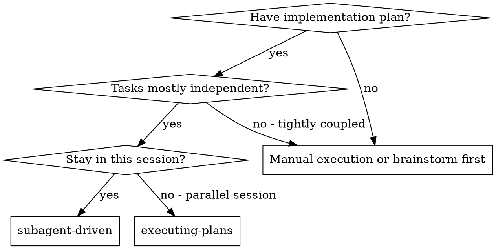
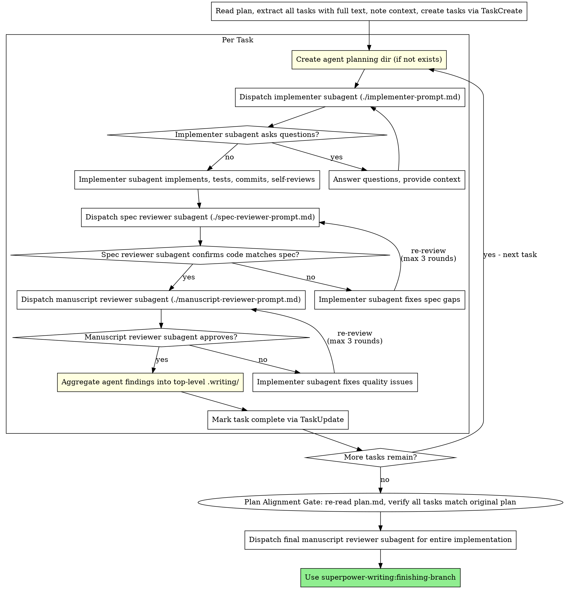

# Subagent-Driven Development

Execute plan by dispatching one new subagent invocation per task, with two-stage review after each: spec compliance review first, then manuscript review. Each subagent gets its own planning directory for structured knowledge capture.

**Core principle:** One new subagent invocation per task + per-agent planning dir + two-stage review (spec then quality) = high quality, fast iteration

**Announce at start:** "I'm using the subagent-driven skill to execute this plan."

## NON-NEGOTIABLE: Two-Stage Review Gate

<EXTREMELY-IMPORTANT>
Every task MUST pass TWO independent reviews before it can be marked complete:

1. **Spec Compliance Review** — Dispatch `./spec-reviewer-prompt.md` subagent
2. **Manuscript Review** — Dispatch `./manuscript-reviewer-prompt.md` subagent (only after spec review passes)

A task is NOT complete until BOTH reviews return APPROVED. No exceptions — not for "simple" tasks, config changes, or thorough self-reviews.

The Task Status Dashboard in `.writing/progress.md` has `Spec Review`, `Quality Review`, and `Plan Align` columns. All three MUST show `PASS` before status can be `complete`.
</EXTREMELY-IMPORTANT>

## Review Loop Caps

Each review loop (spec compliance and manuscript quality) is capped at **3 fix-review rounds** per task.

**Round counting:** The initial review does not count as a round. A "round" is one fix-then-re-review cycle: initial review → fix → re-review (round 1) → fix → re-review (round 2) → fix → re-review (round 3) → STOP.

**After 3 rounds without approval, STOP the loop and escalate to the user:**

1. List what issues remain unresolved
2. Summarize what was attempted in each round
3. Ask the user to decide:
   - **Override and approve** — accept the current state despite open issues
   - **Provide guidance** — give specific direction for a targeted fix (does NOT reset the counter)
   - **Abort the task** — stop work on this task entirely

**Track round count** in the Task Status Dashboard. Use notation like `FAIL (round 2/3)` in the Spec Review or Quality Review column.

## When to Use



**vs. Executing Plans (parallel session):**
- Same session (no context switch)
- One new subagent invocation per task (no context pollution)
- Per-agent planning directories (structured knowledge capture)
- Two-stage review after each task: spec compliance first, then manuscript quality
- Faster iteration (no human-in-loop between tasks)

## Plan Anchoring: How to Extract Tasks

When extracting tasks from `plan.md` to dispatch to subagents:

1. **Copy verbatim** — Use the exact text from `plan.md`, do not paraphrase or summarize
2. **Include the section reference** — Tell the subagent which section header in `plan.md` contains this task (e.g., `### Task 3: Recovery modes`)
3. **Include cross-task constraints** — If `plan.md` or `design.md` has global constraints (shared interfaces, naming conventions, performance requirements), include them in the context section
4. **Pass plan file paths** — Always include `plan.md` and `design.md` paths so subagents can cross-reference the originals

**Why:** The orchestrator's extraction is the #1 source of plan drift. Verbatim copying + plan references let subagents and reviewers independently verify against the source of truth.

## The Process



## Per-Agent Planning Directories

Each agent role gets ONE directory, reused across all tasks:

```bash
mkdir -p .writing/agents/{role}/
```

Example:
```bash
mkdir -p .writing/agents/implementer/
mkdir -p .writing/agents/spec-reviewer/
mkdir -p .writing/agents/manuscript-reviewer/
```

Each agent planning dir contains:
- `findings.md` - Discoveries, decisions, critical items (appended across tasks)
- `progress.md` - Step-by-step progress log (appended across tasks)

**Do NOT create per-task directories** like `implementer-task-1/`, `implementer-task-2/`. One directory per role, updated continuously.

Include the planning dir path in the agent's prompt using `./implementer-prompt.md` template.

## Orchestrator Aggregation Flow

After each task completes (both reviews passed), aggregate the agent's findings:

```bash
${CLAUDE_PLUGIN_ROOT}/scripts/aggregate-agent-findings.sh "<role>" "Task N: <name>"
```

This extracts "Critical for Orchestrator" items and appends them to top-level `.writing/findings.md` and `.writing/progress.md`. Then manually:
- **Update the Task Status Dashboard table** at the top (add/update the row for this task)
- **Append** completion details to the session log section

Example aggregation:
```markdown
<!-- Append to .writing/findings.md -->
## Task 2: Recovery modes
- [From implementer] Database migration requires careful ordering
- [From spec-reviewer] All requirements met after fix pass
- [From manuscript-reviewer] Approved with no issues

<!-- Update Task Status Dashboard table in .writing/progress.md -->
| Task 1: Hook installation | ✅ complete | PASS | PASS | PASS | agents/implementer/ | 5 tests passing |
| Task 2: Recovery modes | ✅ complete | PASS (2nd pass) | PASS | PASS | agents/implementer/ | 8 tests passing |
| Task 3: Config parser | ⏳ pending | - | - | - | - | - |

<!-- Append to session log in .writing/progress.md -->
- [x] Task 2: Recovery modes - COMPLETED
  - Implementer: 8 tests passing, committed
  - Spec review: Passed (2nd pass after fix)
  - Quality review: Approved
```

## Prompt Templates

- `./implementer-prompt.md` - Dispatch implementer subagent (includes planning dir injection)
- `./spec-reviewer-prompt.md` - Dispatch spec compliance reviewer subagent
- `./manuscript-reviewer-prompt.md` - Dispatch manuscript reviewer subagent

## Example Workflow

```
You: I'm using Subagent-Driven Development to execute this plan.

[Read plan file once: .writing/plan.md]
[Extract all 5 tasks with full text and context]
[Create all tasks via TaskCreate]

Task 1: Hook installation script

[Create .writing/agents/implementer/ (if not exists)]
[Dispatch implementation subagent with full task text + context + planning dir]

Implementer: "Before I begin - should the hook be installed at user or system level?"

You: "User level (~/.config/superpowers/hooks/)"

Implementer: "Got it. Implementing now..."
[Later] Implementer:
  - Implemented install-hook command
  - Added tests, 5/5 passing
  - Self-review: Found I missed --force flag, added it
  - Committed
  - Logged findings to .writing/agents/implementer/findings.md

[Dispatch spec compliance reviewer with its own planning dir]
Spec reviewer: Spec compliant - all requirements met, nothing extra

[Get git SHAs, dispatch manuscript reviewer]
Manuscript reviewer: Strengths: Good test coverage, clean. Issues: None. Approved.

[Aggregate: read agent findings, append to .writing/findings.md and progress.md]
[Mark Task 1 complete]

Task 2: Recovery modes

[Reuse .writing/agents/implementer/ (already exists from Task 1)]
[Dispatch implementation subagent with full task text + context + planning dir]

Implementer: [No questions, proceeds]
Implementer:
  - Added verify/repair modes
  - 8/8 tests passing
  - Self-review: All good
  - Committed

[Dispatch spec compliance reviewer]
Spec reviewer: Issues:
  - Missing: Progress reporting (spec says "report every 100 items")
  - Extra: Added --json flag (not requested)

[Implementer fixes issues]
Implementer: Removed --json flag, added progress reporting

[Spec reviewer reviews again]
Spec reviewer: Spec compliant now

[Dispatch manuscript reviewer]
Manuscript reviewer: Strengths: Solid. Issues (Important): Magic number (100)

[Implementer fixes]
Implementer: Extracted PROGRESS_INTERVAL constant

[Manuscript reviewer reviews again]
Manuscript reviewer: Approved

[Aggregate agent findings into .writing/]
[Mark Task 2 complete]

...

[After all tasks]
[Dispatch final manuscript reviewer]
Final reviewer: All requirements met, ready to merge

Done!
```

## Advantages

**vs. Manual execution:**
- Subagents follow TDD naturally
- Fresh context per task (no confusion)
- Parallel-safe (subagents don't interfere)
- Subagent can ask questions (before AND during work)
- Per-agent planning dirs capture knowledge persistently

**vs. Executing Plans:**
- Same session (no handoff)
- Continuous progress (no waiting)
- Review checkpoints automatic

**Efficiency gains:**
- No file reading overhead (controller provides full text)
- Controller curates exactly what context is needed
- Subagent gets complete information upfront
- Questions surfaced before work begins (not after)
- Planning dirs prevent knowledge loss between subagents

**Quality gates:**
- Self-review catches issues before handoff
- Two-stage review: spec compliance, then manuscript quality
- Review loops ensure fixes actually work
- Spec compliance prevents over/under-building
- Manuscript quality ensures implementation is well-built
- Aggregation preserves findings for future tasks

**Cost:**
- More subagent invocations (implementer + 2 reviewers per task)
- Controller does more prep work (extracting all tasks upfront)
- Review loops add iterations
- But catches issues early (cheaper than debugging later)

## Plan Alignment Gate

After ALL tasks complete and BEFORE the final manuscript review, perform a plan alignment check:

1. **Re-read `.writing/plan.md`** completely — refresh the original requirements in context
2. **Re-read `.writing/design.md`** if it exists — refresh architectural constraints
3. **For each completed task**, verify:
   - Does the implementation match what the plan specified (not just what you extracted)?
   - Were any cross-task constraints in the plan respected (shared interfaces, naming, etc.)?
   - Did accumulated decisions across tasks drift from the plan's original intent?
4. **Record results** in `.writing/progress.md`:
   - Update the `Plan Align` column in the Task Status Dashboard
   - If drift is detected: log it in `.writing/findings.md` with specific details
5. **If significant drift is detected**, escalate to the user BEFORE the final manuscript review:
   - Describe what drifted and why
   - Propose corrective action
   - Let the user decide whether to fix or accept

**This gate catches cumulative drift that per-task reviews miss.** Individual tasks may each pass spec review while the whole implementation drifts from the plan's intent.

## Red Flags

**Never:**
- **Skip reviews** — see Two-Stage Review Gate above. No exceptions.
- Start implementation on main/master branch without explicit user consent
- Dispatch multiple implementation subagents in parallel (conflicts)
- Make subagent read plan file (provide full text instead)
- Skip scene-setting context (subagent needs to understand where task fits)
- Ignore subagent questions (answer before letting them proceed)
- Accept "close enough" on spec compliance (reviewer found issues = not done)
- Start manuscript review before spec compliance passes (wrong order)
- Skip planning dir creation or aggregation step (knowledge gets lost)

**If subagent asks questions:**
- Answer clearly and completely
- Provide additional context if needed
- Don't rush them into implementation

**If reviewer finds issues:**
- Implementer (same subagent) fixes them
- Reviewer reviews again
- Maximum 3 fix-review rounds per review stage
- After 3 rounds without approval: escalate to user (do NOT continue looping)
- Don't skip the re-review

**If subagent fails task:**
- Dispatch fix subagent with specific instructions
- Don't try to fix manually (context pollution)

## Integration

**Required workflow skills:**
- **superpower-writing:git-worktrees** - RECOMMENDED: Set up isolated workspace unless already on a feature branch
- **superpower-writing:writing-plans** - Creates the plan this skill executes
- **superpower-writing:finishing-branch** - Complete development after all tasks

After review passes, merge per the repo's review conventions.

**Subagents should use claim-first discipline:** Follow test-first discipline: write a failing test (or claim stub), watch it fail, write the minimal implementation, watch it pass.

**Alternative workflow:**
- **superpower-writing:executing-plans** - Use for parallel session instead of same-session execution
