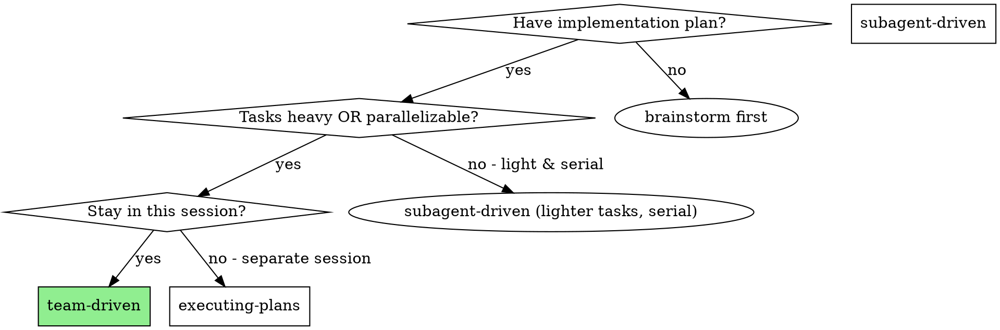
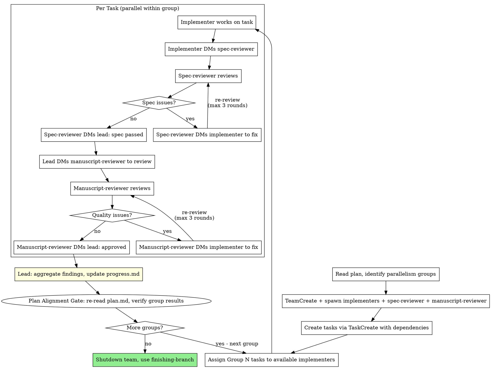

# Team-Driven Development

Execute plan by creating an Agent Team with persistent implementer teammates and dedicated spec and manuscript reviewers. Teammates work in parallel on independent tasks, with two-stage review providing continuous quality gates.

**Core principle:** Persistent teammates + parallel execution + two-stage review (spec then quality) = high throughput, context resilience, quality assurance

**Announce at start:** "I'm using the team-driven skill to execute this plan with an Agent Team."

## Shared Review Protocol

The two-stage review gate (spec then quality), the 3-round cap with escalation, the plan-anchoring rules for verbatim task extraction, the plan-alignment gate for cumulative drift, and the per-agent planning-directory convention are the same across team-driven and subagent-driven. They live in [`../planning-foundation/references/review-loop-protocol.md`](../planning-foundation/references/review-loop-protocol.md) — read it before spawning the team. This skill applies that protocol using persistent teammates: the implementer DMs the spec-reviewer directly, the lead activates the manuscript-reviewer after spec passes, and the plan-alignment gate runs after each parallelism group rather than once at the end.

## When to Use



**Two independent advantages over subagent-driven:**

1. **Parallelism** — Independent tasks execute simultaneously across multiple implementers
2. **Context resilience** — Each teammate has its own full context window. Subagents share the parent's context limit and can crash on heavy tasks. Teammates don't have this problem.

**Even without parallelism, team-driven is preferred for heavy tasks** where a single subagent might hit context limits.

## Team Structure

```
Team Lead (you, current session)
├── implementer-1 (teammate)     ──→ Task A ─┐
├── implementer-2 (teammate)     ──→ Task B ──┤── parallel
├── implementer-N (teammate)     ──→ Task C ─┘
├── spec-reviewer (teammate)     ──→ spec compliance review
└── manuscript-reviewer (teammate)  ──→ manuscript quality review
```

- **Team lead:** Reads plan, creates tasks, assigns work, orchestrates review handoffs, aggregates findings, updates progress.md
- **Implementers:** Persistent teammates, each works on assigned tasks, DMs spec-reviewer when done
- **Spec-reviewer:** Verifies the manuscript matches the original plan. DMs implementer for spec fixes, DMs lead when spec passes.
- **Manuscript-reviewer:** Verifies the manuscript is well-built. Activated by lead after spec passes. DMs implementer for quality fixes, DMs lead when approved.

## The Process



## Step-by-Step

### Step 1: Read Plan and Identify Parallelism

Read the plan file. Look for the `### Parallelism Groups` section:

```markdown
### Parallelism Groups
- **Group A** (parallel): Task 1, Task 2, Task 3
- **Group B** (after Group A): Task 4, Task 5
- **Group C** (after Group B): Task 6
```

If no parallelism groups are defined, treat each task as its own group (serial execution — still benefits from context resilience).

Determine `MAX_PARALLEL` = largest group size. This is the number of implementer teammates to spawn.

### Step 2: Create Team and Spawn Teammates

```
TeamCreate: team_name="plan-execution"

# Spawn implementers (one per max parallel slot)
Task(team_name="plan-execution", name="implementer-1", subagent_type="general-purpose")
Task(team_name="plan-execution", name="implementer-2", subagent_type="general-purpose")
...

# Spawn spec-reviewer
Task(team_name="plan-execution", name="spec-reviewer", subagent_type="superpower-writing:spec-reviewer")

# Spawn manuscript-reviewer
Task(team_name="plan-execution", name="manuscript-reviewer", subagent_type="superpower-writing:manuscript-reviewer")
```

**Implementer teammate prompt:** Use `./implementer-teammate-prompt.md` template.

**Spec-reviewer teammate prompt:** Use `./spec-reviewer-teammate-prompt.md` template.

**Manuscript-reviewer teammate prompt:** Use `./manuscript-reviewer-teammate-prompt.md` template.

<EXTREMELY-IMPORTANT>
**FIXED POOL — No New Implementers After Setup**

The implementers spawned in this step are the ONLY implementers for the entire plan execution. You MUST NOT create additional implementers later, regardless of the reason.

- If all implementers are busy → **wait** for one to finish, then assign the next task
- If a new parallelism group has more tasks than implementers → **run in waves** (assign to implementers as they become free)
- NEVER create an implementer named after a task (e.g., `implementer-task6`, `implementer-task-N`) — implementers are named `implementer-1`, `implementer-2`, etc. and are reused across all tasks

Creating new implementers mid-execution wastes resources, fragments context, and violates the persistent-teammate design.
</EXTREMELY-IMPORTANT>

### Step 3: Create Tasks and Set Dependencies

Create all tasks via TaskCreate. Set `addBlockedBy` for tasks in later groups:

```
TaskCreate: "Task 1: ..." (Group A)
TaskCreate: "Task 2: ..." (Group A)
TaskCreate: "Task 3: ..." (Group A)
TaskCreate: "Task 4: ..." (Group B) → addBlockedBy: [1, 2, 3]
TaskCreate: "Task 5: ..." (Group B) → addBlockedBy: [1, 2, 3]
TaskCreate: "Task 6: ..." (Group C) → addBlockedBy: [4, 5]
```

### Step 4: Assign Tasks

For the current group, assign tasks to implementers:

```
TaskUpdate: taskId="1", owner="implementer-1"
TaskUpdate: taskId="2", owner="implementer-2"
TaskUpdate: taskId="3", owner="implementer-3"

SendMessage: type="message", recipient="implementer-1", content="Please work on Task 1: [full task text from plan]"
SendMessage: type="message", recipient="implementer-2", content="Please work on Task 2: [full task text from plan]"
...
```

**IMPORTANT:** Include the full task text in the message. Don't make teammates read the plan file.

### Step 5: Monitor and Orchestrate Reviews

As teammates complete tasks, the lead orchestrates the two-stage review flow:

1. **Implementer completes task** → DMs spec-reviewer with report
2. **Spec-reviewer reviews** → if issues, DMs implementer to fix (max 3 rounds) → if passes, DMs lead
3. **Lead receives spec pass** → DMs manuscript-reviewer to start manuscript review for this task
4. **Manuscript-reviewer reviews** → if issues, DMs implementer to fix (max 3 rounds) → if passes, DMs lead
5. **Lead receives quality pass** → task is approved

**On escalation** (after 3 rounds without approval from either reviewer): lead presents unresolved issues to user for decision.

**On plan drift** (spec-reviewer reports): lead corrects the task extraction and re-assigns with accurate requirements.

**After approval:**
- **Lead updates progress.md Dashboard** — mark task complete, note key outcome
- **Lead aggregates findings:** `${CLAUDE_PLUGIN_ROOT}/scripts/aggregate-agent-findings.sh "<role>" "Task N: <name>"`
- **Lead assigns next tasks** to the **same teammate that just finished** if unblocked tasks exist — reuse the existing implementer pool, NEVER spawn new ones

### Step 5.5: Plan Alignment Gate (After Each Parallelism Group)

Run the plan-alignment gate from the shared review-loop protocol before starting the next group. Team-driven runs this gate after every parallelism group (not just at the end) because drift is cheaper to correct between groups. Only proceed to the next group after the gate passes.

### Step 6: Shutdown

After all tasks complete:

1. Update `.writing/progress.md` with final status
2. Send shutdown requests to all teammates
3. **REQUIRED SUB-SKILL:** Use superpower-writing:finishing-branch

## Prompt Templates

- `./implementer-teammate-prompt.md` — Initial prompt for spawning implementer teammates
- `./spec-reviewer-teammate-prompt.md` — Initial prompt for spawning the spec-reviewer teammate
- `./manuscript-reviewer-teammate-prompt.md` — Initial prompt for spawning the manuscript-reviewer teammate

## Example Workflow

A worked example across three parallelism groups with a three-implementer fixed pool, including one spec-review fail-and-fix and one manuscript-review fail-and-fix, lives in [`references/example-session.md`](references/example-session.md). Read it when you need to see how the digraph above maps to actual team messages.

## vs Subagent-Driven

| Dimension | Subagent-Driven | Team-Driven |
|-----------|----------------|-------------|
| Parallelism | Serial only | Parallel within groups |
| Context lifetime | One-shot (dies after task) | Persistent (survives across tasks) |
| Context limit | Shares parent's limit | Own full context window |
| Review model | Two-stage: new spec + quality subagent per task | Two-stage: persistent spec-reviewer + manuscript-reviewer teammates |
| Communication | Through lead only | Peer DM (implementer ↔ reviewers) |
| Cost | Lower (serial execution) | Higher (parallel agents) |
| Best for | Light serial tasks | Heavy tasks, parallelizable work |

## Red Flags

**Never:**
- **Skip either reviewer for any task — this is the #1 rule. NO EXCEPTIONS. Every task MUST pass both spec review and manuscript review before it can be marked complete.**
- **Start manuscript review before spec review passes** — spec compliance is a prerequisite for manuscript review.
- **Create new implementers after initial setup** — the implementer pool is fixed at Step 2. If all are busy, WAIT. Never spawn `implementer-task6`, `implementer-taskN`, or any ad-hoc implementer.
- Loop reviews more than 3 rounds per stage without escalating to the user
- Assign two implementers to tasks that edit the same files
- Let implementers communicate directly with each other (use lead as coordinator for cross-task concerns)
- Proceed to next group before current group is fully reviewed and approved
- Forget to aggregate findings from agent planning dirs

**If teammate goes idle:**
- Idle is normal — it means they're waiting for input
- Send them a message to wake them up with new work
- Don't treat idle as an error

**If teammate hits a blocker:**
- Teammate should DM lead describing the blocker
- Lead resolves (provide info, reassign, or escalate to user)
- Don't let blocked teammates spin

## Integration

**Required workflow skills:**
- **superpower-writing:git-worktrees** — RECOMMENDED: Set up isolated workspace unless already on a feature branch
- **superpower-writing:writing-plans** — Creates the plan with parallelism groups
- **superpower-writing:finishing-branch** — Complete development after all tasks

**Complementary skills:**
- **superpower-writing:verification** — Final verification before declaring done
