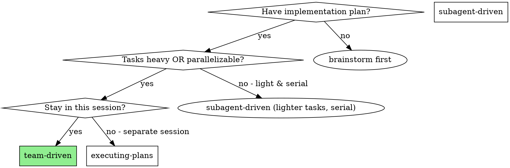
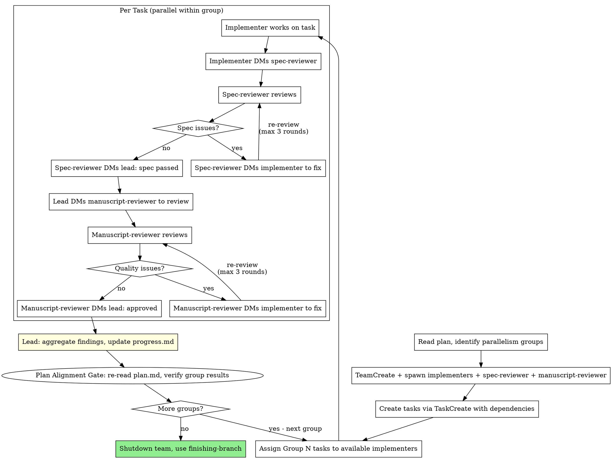

# Team-Driven Development

Execute plan by creating an Agent Team with persistent implementer teammates and dedicated spec and manuscript reviewers. Teammates work in parallel on independent tasks, with two-stage review providing continuous quality gates.

**Core principle:** Persistent teammates + parallel execution + two-stage review (spec then quality) = high throughput, context resilience, quality assurance

**Announce at start:** "I'm using the team-driven skill to execute this plan with an Agent Team."

## NON-NEGOTIABLE: Two-Stage Review Gate

<EXTREMELY-IMPORTANT>
Every task MUST pass TWO independent reviews before it can be marked complete:

1. **Spec Compliance Review** — spec-reviewer teammate verifies code matches the original plan
2. **Code Manuscript Review** — manuscript-reviewer teammate verifies code is well-built (only after spec review passes)

**A task is NOT complete until the manuscript-reviewer DMs the lead with APPROVED.**

You MUST NOT:
- Skip either reviewer for ANY reason ("task was simple", "just a config change")
- Mark a task complete without BOTH reviewers approving
- Start manuscript review before spec review passes
- Proceed to the next parallelism group while any task has open review issues

The Task Status Dashboard in `.writing/progress.md` has `Spec Review`, `Manuscript Review`, and `Plan Align` columns.
A task row MUST show `PASS` in ALL THREE columns before you can set its status to `complete`.
</EXTREMELY-IMPORTANT>

## Review Loop Caps

Each review stage has its own cap of **3 fix-review rounds**.

**Round counting:** The initial review does not count as a round. A "round" is one fix-then-re-review cycle: initial review → DM implementer to fix → re-review (round 1) → DM fix → re-review (round 2) → DM fix → re-review (round 3) → STOP.

**After 3 rounds without approval, the reviewer MUST DM the team lead to escalate.** The escalation message should include:

1. What issues remain unresolved
2. What was attempted in each round
3. Whether the issues are getting better, worse, or stuck

**The team lead then escalates to the user** with three choices:
- **Override and approve** — accept the current state despite open issues
- **Provide guidance** — give specific direction for a targeted fix (does NOT reset the counter)
- **Abort the task** — stop work on this task entirely

**Track round count** in the Task Status Dashboard. Use notation like `FAIL (round 2/3)` in the review columns.

## When to Use



**Two independent advantages over subagent-driven:**

1. **Parallelism** — Independent tasks execute simultaneously across multiple implementers
2. **Context resilience** — Each teammate has its own full context window. Subagents share the parent's context limit and can crash on heavy tasks. Teammates don't have this problem.

**Even without parallelism, team-driven is preferred for heavy tasks** where a single subagent might hit context limits.

## Team Structure

```
Team Lead (you, current session)
├── implementer-1 (teammate)     ──→ Task A ─┐
├── implementer-2 (teammate)     ──→ Task B ──┤── parallel
├── implementer-N (teammate)     ──→ Task C ─┘
├── spec-reviewer (teammate)     ──→ spec compliance review
└── manuscript-reviewer (teammate)  ──→ code manuscript review
```

- **Team lead:** Reads plan, creates tasks, assigns work, orchestrates review handoffs, aggregates findings, updates progress.md
- **Implementers:** Persistent teammates, each works on assigned tasks, DMs spec-reviewer when done
- **Spec-reviewer:** Verifies code matches the original plan. DMs implementer for spec fixes, DMs lead when spec passes.
- **Manuscript-reviewer:** Verifies code is well-built. Activated by lead after spec passes. DMs implementer for quality fixes, DMs lead when approved.

## The Process



## Plan Anchoring: How to Extract Tasks

When extracting tasks from `plan.md` to send to implementer teammates:

1. **Copy verbatim** — Use the exact text from `plan.md`, do not paraphrase or summarize
2. **Include the section reference** — Tell the implementer which section header in `plan.md` contains this task (e.g., `### Task 3: Recovery modes`)
3. **Include cross-task constraints** — If `plan.md` or `design.md` has global constraints (shared interfaces, naming conventions, performance requirements), include them
4. **Pass plan file paths** — Always mention that `.writing/plan.md` and `.writing/design.md` are available for cross-reference

**Why:** The lead's extraction is the #1 source of plan drift. Verbatim copying + plan references let implementers and reviewers independently verify against the source of truth.

## Step-by-Step

### Step 1: Read Plan and Identify Parallelism

Read the plan file. Look for the `### Parallelism Groups` section:

```markdown
### Parallelism Groups
- **Group A** (parallel): Task 1, Task 2, Task 3
- **Group B** (after Group A): Task 4, Task 5
- **Group C** (after Group B): Task 6
```

If no parallelism groups are defined, treat each task as its own group (serial execution — still benefits from context resilience).

Determine `MAX_PARALLEL` = largest group size. This is the number of implementer teammates to spawn.

### Step 2: Create Team and Spawn Teammates

```
TeamCreate: team_name="plan-execution"

# Spawn implementers (one per max parallel slot)
Task(team_name="plan-execution", name="implementer-1", subagent_type="general-purpose")
Task(team_name="plan-execution", name="implementer-2", subagent_type="general-purpose")
...

# Spawn spec-reviewer
Task(team_name="plan-execution", name="spec-reviewer", subagent_type="superpower-writing:spec-reviewer")

# Spawn manuscript-reviewer
Task(team_name="plan-execution", name="manuscript-reviewer", subagent_type="superpower-writing:manuscript-reviewer")
```

**Implementer teammate prompt:** Use `./implementer-teammate-prompt.md` template.

**Spec-reviewer teammate prompt:** Use `./spec-reviewer-teammate-prompt.md` template.

**Manuscript-reviewer teammate prompt:** Use `./manuscript-reviewer-teammate-prompt.md` template.

<EXTREMELY-IMPORTANT>
**FIXED POOL — No New Implementers After Setup**

The implementers spawned in this step are the ONLY implementers for the entire plan execution. You MUST NOT create additional implementers later, regardless of the reason.

- If all implementers are busy → **wait** for one to finish, then assign the next task
- If a new parallelism group has more tasks than implementers → **run in waves** (assign to implementers as they become free)
- NEVER create an implementer named after a task (e.g., `implementer-task6`, `implementer-task-N`) — implementers are named `implementer-1`, `implementer-2`, etc. and are reused across all tasks

Creating new implementers mid-execution wastes resources, fragments context, and violates the persistent-teammate design.
</EXTREMELY-IMPORTANT>

### Step 3: Create Tasks and Set Dependencies

Create all tasks via TaskCreate. Set `addBlockedBy` for tasks in later groups:

```
TaskCreate: "Task 1: ..." (Group A)
TaskCreate: "Task 2: ..." (Group A)
TaskCreate: "Task 3: ..." (Group A)
TaskCreate: "Task 4: ..." (Group B) → addBlockedBy: [1, 2, 3]
TaskCreate: "Task 5: ..." (Group B) → addBlockedBy: [1, 2, 3]
TaskCreate: "Task 6: ..." (Group C) → addBlockedBy: [4, 5]
```

### Step 4: Assign Tasks

For the current group, assign tasks to implementers:

```
TaskUpdate: taskId="1", owner="implementer-1"
TaskUpdate: taskId="2", owner="implementer-2"
TaskUpdate: taskId="3", owner="implementer-3"

SendMessage: type="message", recipient="implementer-1", content="Please work on Task 1: [full task text from plan]"
SendMessage: type="message", recipient="implementer-2", content="Please work on Task 2: [full task text from plan]"
...
```

**IMPORTANT:** Include the full task text in the message. Don't make teammates read the plan file.

### Step 5: Monitor and Orchestrate Reviews

As teammates complete tasks, the lead orchestrates the two-stage review flow:

1. **Implementer completes task** → DMs spec-reviewer with report
2. **Spec-reviewer reviews** → if issues, DMs implementer to fix (max 3 rounds) → if passes, DMs lead
3. **Lead receives spec pass** → DMs manuscript-reviewer to start manuscript review for this task
4. **Manuscript-reviewer reviews** → if issues, DMs implementer to fix (max 3 rounds) → if passes, DMs lead
5. **Lead receives quality pass** → task is approved

**On escalation** (after 3 rounds without approval from either reviewer): lead presents unresolved issues to user for decision.

**On plan drift** (spec-reviewer reports): lead corrects the task extraction and re-assigns with accurate requirements.

**After approval:**
- **Lead updates progress.md Dashboard** — mark task complete, note key outcome
- **Lead aggregates findings:** `${CLAUDE_PLUGIN_ROOT}/scripts/aggregate-agent-findings.sh "<role>" "Task N: <name>"`
- **Lead assigns next tasks** to the **same teammate that just finished** if unblocked tasks exist — reuse the existing implementer pool, NEVER spawn new ones

### Step 5.5: Plan Alignment Gate (After Each Parallelism Group)

After ALL tasks in a parallelism group are reviewed and approved:

1. **Re-read `.writing/plan.md`** — refresh original requirements in context
2. **For each completed task in this group**, verify:
   - Does the implementation match the plan (not just what was extracted)?
   - Were cross-task constraints respected (shared interfaces, naming, etc.)?
3. **Update `Plan Align` column** in the Task Status Dashboard
4. **If significant drift detected**, escalate to user BEFORE starting the next group:
   - Describe what drifted and why
   - Propose corrective action
   - Let user decide whether to fix or accept

**This gate catches cumulative drift that per-task reviews miss.** Only proceed to the next parallelism group after this check passes.

### Step 6: Shutdown

After all tasks complete:

1. Update `.writing/progress.md` with final status
2. Send shutdown requests to all teammates
3. **REQUIRED SUB-SKILL:** Use superpower-writing:finishing-branch

## Per-Agent Planning Directories

Each **persistent teammate** maintains a single planning directory across all tasks:

```bash
mkdir -p .writing/agents/implementer-1/
mkdir -p .writing/agents/implementer-2/
mkdir -p .writing/agents/spec-reviewer/
mkdir -p .writing/agents/manuscript-reviewer/
```

Implementers update the same `findings.md` and `progress.md` as they work on successive tasks. This keeps context continuous rather than fragmented across per-task folders.

**Note:** Subagent-driven follows the same convention — one directory per role (e.g., `implementer/`), reused across tasks. Do NOT create per-task directories like `implementer-task-N/`.

## Prompt Templates

- `./implementer-teammate-prompt.md` — Initial prompt for spawning implementer teammates
- `./spec-reviewer-teammate-prompt.md` — Initial prompt for spawning the spec-reviewer teammate
- `./manuscript-reviewer-teammate-prompt.md` — Initial prompt for spawning the manuscript-reviewer teammate

## Example Workflow

```
You: I'm using Team-Driven Development to execute this plan.

[Read plan: .writing/plan.md]
[Identify groups: Group A (Tasks 1,2,3), Group B (Tasks 4,5), Group C (Task 6)]
[MAX_PARALLEL = 3]

[TeamCreate: "plan-execution"]
[Spawn: implementer-1, implementer-2, implementer-3, spec-reviewer, manuscript-reviewer]
[Create all 6 tasks via TaskCreate with group dependencies]

=== Group A (parallel) ===

[Assign Task 1 → implementer-1, Task 2 → implementer-2, Task 3 → implementer-3]
[Send full task text to each implementer]

[implementer-1 working on Task 1...]
[implementer-2 working on Task 2...]
[implementer-3 working on Task 3...]

implementer-2 → spec-reviewer: "Task 2 done. [report]"
spec-reviewer → implementer-2: "Missing error handling for edge case X (spec requires it)"
implementer-2: fixes issue
implementer-2 → spec-reviewer: "Fixed. [updated report]"
spec-reviewer → lead: "Task 2 spec review passed"
lead → manuscript-reviewer: "Please review Task 2 for manuscript quality"
manuscript-reviewer → lead: "Task 2 manuscript review passed"

implementer-1 → spec-reviewer: "Task 1 done. [report]"
spec-reviewer → lead: "Task 1 spec review passed"
lead → manuscript-reviewer: "Please review Task 1 for manuscript quality"
manuscript-reviewer → implementer-1: "Magic number on line 42, extract constant"
implementer-1: fixes
implementer-1 → manuscript-reviewer: "Fixed."
manuscript-reviewer → lead: "Task 1 manuscript review passed"

implementer-3 → spec-reviewer: "Task 3 done. [report]"
spec-reviewer → lead: "Task 3 spec review passed"
lead → manuscript-reviewer: "Please review Task 3 for manuscript quality"
manuscript-reviewer → lead: "Task 3 manuscript review passed"

[Lead: aggregate findings, update progress.md, unblock Group B]

=== Group B (parallel, after A) ===

[Assign Task 4 → implementer-1, Task 5 → implementer-2]
[implementer-3 is idle — can be shut down or held for Group C]

... same pattern ...

=== Group C ===

[Assign Task 6 → implementer-1]
... spec-reviewer approves, manuscript-reviewer approves ...

[All tasks complete]
[Shutdown team]
[Use finishing-branch skill]
```

## vs Subagent-Driven

| Dimension | Subagent-Driven | Team-Driven |
|-----------|----------------|-------------|
| Parallelism | Serial only | Parallel within groups |
| Context lifetime | One-shot (dies after task) | Persistent (survives across tasks) |
| Context limit | Shares parent's limit | Own full context window |
| Review model | Two-stage: new spec + quality subagent per task | Two-stage: persistent spec-reviewer + manuscript-reviewer teammates |
| Communication | Through lead only | Peer DM (implementer ↔ reviewers) |
| Cost | Lower (serial execution) | Higher (parallel agents) |
| Best for | Light serial tasks | Heavy tasks, parallelizable work |

## Red Flags

**Never:**
- **Skip either reviewer for any task — this is the #1 rule. NO EXCEPTIONS. Every task MUST pass both spec review and manuscript review before it can be marked complete.**
- **Start manuscript review before spec review passes** — spec compliance is a prerequisite for manuscript review.
- **Create new implementers after initial setup** — the implementer pool is fixed at Step 2. If all are busy, WAIT. Never spawn `implementer-task6`, `implementer-taskN`, or any ad-hoc implementer.
- Loop reviews more than 3 rounds per stage without escalating to the user
- Assign two implementers to tasks that edit the same files
- Let implementers communicate directly with each other (use lead as coordinator for cross-task concerns)
- Proceed to next group before current group is fully reviewed and approved
- Forget to aggregate findings from agent planning dirs

**If teammate goes idle:**
- Idle is normal — it means they're waiting for input
- Send them a message to wake them up with new work
- Don't treat idle as an error

**If teammate hits a blocker:**
- Teammate should DM lead describing the blocker
- Lead resolves (provide info, reassign, or escalate to user)
- Don't let blocked teammates spin

## Integration

**Required workflow skills:**
- **superpower-writing:git-worktrees** — RECOMMENDED: Set up isolated workspace unless already on a feature branch
- **superpower-writing:writing-plans** — Creates the plan with parallelism groups
- **superpower-writing:finishing-branch** — Complete development after all tasks

**Complementary skills:**
- **superpower-writing:verification** — Final verification before declaring done
